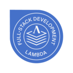

# Heather Nuffer--@ethyl2

👋 Hi, I'm Heather.

👩 I am a web developer who fuses a background in science 🧪 and the arts 🎨, with attention to detail and design, to deliver quality websites and applications.

🧠 I love learning about new technologies and enjoy teaching others what I learn. I'm known for a strong work ethic, dependability, and effective team collaboration. I am excited to keep progressing in my career and look forward to opportunities which will allow me to improve my skills.

🍳 Creating things is my passion. When I'm not coding web applications, you can find me making something with fabric, music, paint, or pen -- or trying out a new vegetarian/vegan recipe in my kitchen.

🎓 I graduated from the full-stack web development program at Lambda School. I also have a BS in microbiology from Brigham Young University.

🧳 Visit my [portfolio](https://www.heathernuffer.com/) and [LinkedIn profile](https://www.linkedin.com/in/heather-nuffer/).

🙏 _Thank you in advance for any connections, advice, or opportunities you can offer._

<!--

-->
<!--
**ethyl2/ethyl2** is a ✨ _special_ ✨ repository because its `README.md` (this file) appears on your GitHub profile.

Here are some ideas to get you started:

- 🔭 I’m currently working on ...
- 🌱 I’m currently learning ...
- 👯 I’m looking to collaborate on ...
- 🤔 I’m looking for help with ...
- 💬 Ask me about ...
- 📫 How to reach me: ...
- 😄 Pronouns: ...
- ⚡ Fun fact: ...
-->
