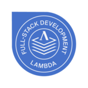

# Heather Nuffer&#8212;@ethyl2

## 👋 Hi, I'm Heather.

👩 I am a web developer who fuses a background in science 🧪 and the arts 🎨, with attention to detail and design, to deliver quality websites and applications.

---

## More About Me

🧠 I love learning about new technologies and enjoy teaching others what I learn. I'm known for a strong work ethic, dependability, and effective team collaboration. I am excited to keep progressing in my career and look forward to opportunities which will allow me to improve my skills. 🎓 I graduated from the full-stack web development program at [Lambda School](https://lambdaschool.com/). I also have a BS in microbiology from [Brigham Young University](https://mmbio.byu.edu/).

🙏 _Thank you in advance for any connections, advice, or opportunities you can offer._

<!--

-->

---

## My Values

🌱 Growth Mindset  
🖼️ Creativity  
🔨 Meaningful Work  
🧑‍🤝‍🧑 Connection  
💎 Integrity

---

## My Skills

🕸️ HTML5 & CSS3  
🌺 LESS & SASS  
⚒️ JavaScript  
🐍 Python  
🗜️ React  
⚙️ Redux & Context API  
✅ Form validation  
💠 Node.js  
💨 Express.js  
🔑 JSON Web Tokens  
🔒 Authentication  
📤 SQL  
😺 Git/GitHub  
🧺 And more!

---

## Get in Touch

🖍️ [Portfolio](https://www.heathernuffer.com/)  
🔗 [LinkedIn](https://www.linkedin.com/in/heather-nuffer/)  
🐦 [Twitter](https://twitter.com/ethyl22000)

<!--
**ethyl2/ethyl2** is a ✨ _special_ ✨ repository because its `README.md` (this file) appears on your GitHub profile.

Here are some ideas to get you started:

- 🔭 I’m currently working on ...
- 🌱 I’m currently learning ...
- 👯 I’m looking to collaborate on ...
- 🤔 I’m looking for help with ...
- 💬 Ask me about ...
- 📫 How to reach me: ...
- 😄 Pronouns: ...
- ⚡ Fun fact: ...
-->
